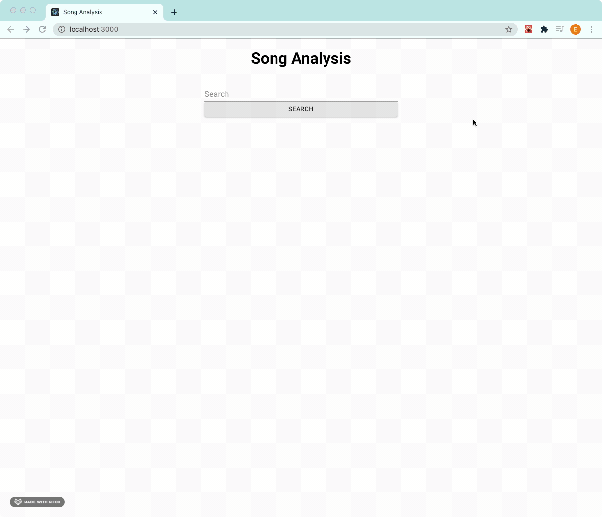

# Song Analysis
> Using [Spotify Api](https://developer.spotify.com/documentation/web-api/) this app allows you to select any song in Spotify's database and display it's audio features.
## Demo

## Tech Frameworks Used
* Spotify API
* React
* MaterialUI
* Express
* MySQL
## Installation
1. Clone repo
2. cd into root directory
3. Run npm start
4. Go to localhost:3000 in browser
